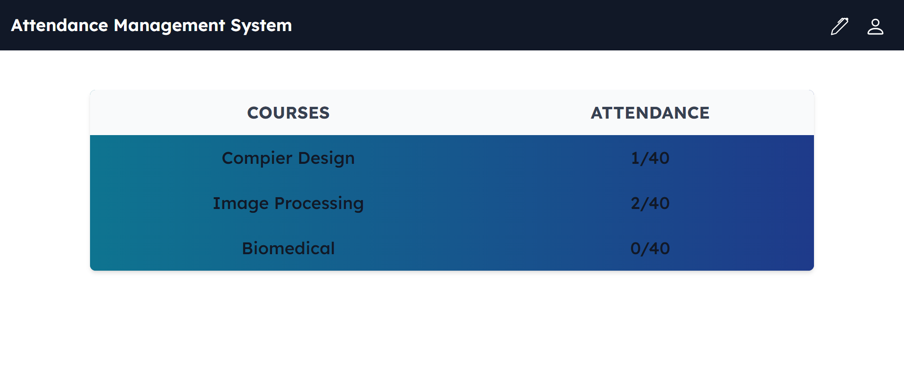
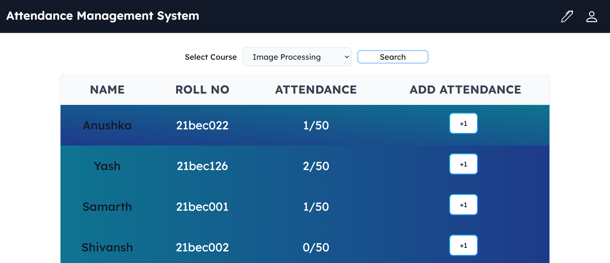

# EDP Project

# Multi-Model Smart Attendance System

## Table of Contents

- [Features](#features)
- [Guide](#guide)
- [Technologies Used](#technologies-used)

  
## Features

- **Attendance management  system for student and faculty.**
- **Two Way identity verification.**
- **A handy device with inbuilt sensor and face camera.**
- **Attendance data can easily be accessed and downloaded in excel or pdf format.Performance data of student can also be calculated.**

## Guide

**The handy device for taking the attendance**:  

**Demonstration of the working model:**:  

**Dashboard to track attendance:**:  
We can longin as student and view our current attendance in the all the courses.

**Dashboard to analyse atteendance**:  
Faculty can login to see the attendance status of individual student in the course.

## Technologies Used

- **React**: For front-end development.
- **MongoDB**: For database management.
- **NodeJs.**: For backend.
- **ExpressJs.**: For backed.
- **Figma**: For UI designing.
- **Python**: Used for writing the backend logic and integration.

## Future Scope

- **Advanced Analytics**: Introduce more detailed and customizable analytics features.
- **Enhance accuracy of the model**: We can use more enhanced model for better detection.

Thank you!!
